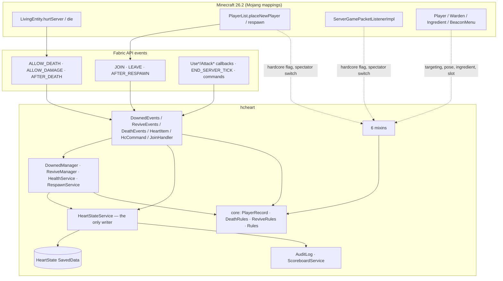
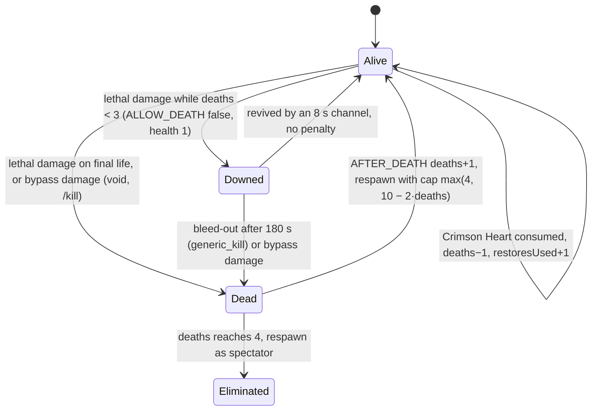

<p align="center">
  
</p>

<h1 align="center">Fractured Hardcore</h1>

<p align="center"><em>Three lives. Make them count.</em></p>

<p align="center">
  <a href="https://github.com/MusaMisto/FracturedHardcore/actions/workflows/build.yml"></a>
  
  
  
  
  
  
  
  
  
  <a href="LICENSE"></a>
  
</p>

**Fractured Hardcore** (mod id `hcheart`) is a **server-side** [Fabric](https://fabricmc.net) mod for Minecraft Java
**26.2** that replaces vanilla hardcore's instant permadeath with a three-tier survival system. Lethal damage makes you
*downed* instead of dead; a friend can revive you. If nobody does, you die for real and your maximum health drops one
step down the ladder **10 → 8 → 6 → 4 hearts**. At four hearts you are on your final life. The fourth death is permanent.
A craftable **Crimson Heart** buys one step back, at a price that only ever goes up.

Players connect with a completely vanilla client. Every piece of UI is a boss bar, action bar, chat line, glow,
pose, particle or sound. Built for a private five-player hardcore server where the worst possible bug deletes a friend's
character, so the code favours **boring and verifiable** over clever.

## Table of contents

- [How it plays](#how-it-plays)
  - [Tier 1: Downed](#tier-1-downed)
  - [Revive](#revive)
  - [Tier 2: True death](#tier-2-true-death)
  - [Tier 3: Final life and elimination](#tier-3-final-life-and-elimination)
  - [The Crimson Heart](#the-crimson-heart)
- [Quick start for server admins](#quick-start-for-server-admins)
- [Commands](#commands)
- [Files the mod writes](#files-the-mod-writes)
- [For contributors and agents](#for-contributors-and-agents)
  - [Toolchain](#toolchain)
  - [Build and test](#build-and-test)
  - [Project layout](#project-layout)
  - [Architecture](#architecture)
  - [Runtime flows](#runtime-flows)
  - [Vanilla touchpoints](#vanilla-touchpoints)
  - [Data model and persistence](#data-model-and-persistence)
  - [Invariants (do not break these)](#invariants-do-not-break-these)
  - [Tuning constants](#tuning-constants)
  - [Testing](#testing)
  - [Upgrading Minecraft or Fabric](#upgrading-minecraft-or-fabric)
  - [Troubleshooting](#troubleshooting)
  - [Known limitations](#known-limitations)
  - [Documentation map and README maintenance](#documentation-map-and-readme-maintenance)
- [Contributing](#contributing)
- [License](#license)

## How it plays

### Tier 1: Downed

When lethal damage arrives and you are **not** on your final life, you do not die. You are **downed**:

- Health is pinned at 1 HP. You lie prone (a 1-block-high hitbox), glow through walls, move at half speed, cannot jump.
- You are **immune to all ordinary damage**. Hostile mobs drop you as a target and cannot re-acquire you. The Warden
  ignores you (its anger, sniffing and sonic boom all route through the same check).
- You cannot attack, place, break, use items or interact with anything. Attempts get an action-bar notice.
- A red boss bar, visible to everyone online, shows who is downed and the time left: **180 seconds of world time**, so
  logging out does not pause it. When it runs out you **bleed out** and die for real.
- Damage that bypasses invulnerability (the void, `/kill`) still kills you outright. That is a true death.
- If the server crashes or you relog while downed, the state is restored from disk: still downed if time remains,
  bled out immediately if not.

### Revive

A living player **right-clicks** the downed player and stays within **2 blocks** of where they started for **8 seconds**.

- The reviver needs at least **6 food points** to begin, or the channel refuses with a message.
- Both players lose **6 food points** over the channel (saturation first, then food), one point at a time.
- The channel breaks and must restart from zero if: the reviver moves more than 2 blocks from the start position, either
  player takes damage, either player's food reaches zero, the two drift more than 4 blocks apart, the reviver dies or is
  downed, or either player disconnects. Both players are told why.
- **One reviver per target.** A second player gets "already being revived by …".
- On success: **zero penalty**. No death counted, no hearts lost, health refilled, a totem sound, a server-wide line.

### Tier 2: True death

Bleeding out (or a bypass source) is a true death. You see the **vanilla death screen with a Respawn button**, respawn at
your bed or world spawn, and your maximum health drops one step. A low bell plays for you; a quieter one for everyone
else. Chat tells you your death count, the new cap, **what a Crimson Heart costs right now**, and how far you are from
your final life. The tab list shows everyone's death count.

### Tier 3: Final life and elimination

At three deaths you sit at **4 hearts permanently**. The downed safety net is gone: lethal damage kills you. A held Totem
of Undying still works as in vanilla, which makes totems final-life insurance. The **fourth death ends your run**: you
respawn as a spectator (stock hardcore behaviour), everyone is told, and the world continues for the others. There is no
world-end condition.

### The Crimson Heart

A Nether Star carrying `minecraft:custom_data {hcheart: true}`, named **Crimson Heart**, epic rarity, glinting. Shaped
recipe:

```
E N E      ★  Nether Star      ×1
N ★ N      N  Netherite Scrap  ×4
E N E      E  Echo Shard       ×4
```

Right-click to consume. It restores **one level** (deaths −1) and refills your health. **The price escalates and never
resets**: the first restoration you ever perform costs 1 Heart, the second 2, the third 3, and so on. The price tracks how
many times *you* have restored, not how many hearts you have. Hearts are drawn from anywhere in your inventory. They are
tradeable: handing your only Heart to the weakest player is a free choice, not an obligation. Consuming a Heart at three
deaths lifts final life again, because final life is derived from the death count.

Why this recipe: Echo Shards are Ancient City loot only and cannot be farmed at scale, so they set the real price; Nether
Stars collapse to an AFK grind once someone builds a wither-skeleton farm. If the recipe ever needs rebalancing, adjust the
netherite and leave the shards alone. Hearts can never be lost: they are rejected by beacon payment slots and are not
accepted as an ingredient in **any** recipe (including the beacon recipe and the Heart recipe itself).

## Quick start for server admins

| Requirement | Version |
|---|---|
| Minecraft Java dedicated server | 26.2 |
| Fabric Loader | ≥ 0.19.5 |
| Fabric API | 0.159.0+26.2 or newer for 26.2 |
| Java | 25 |

1. Download `fractured-hardcore-<version>.jar` from the [releases](https://github.com/MusaMisto/FracturedHardcore/releases)
   or the latest [build artifact](https://github.com/MusaMisto/FracturedHardcore/actions/workflows/build.yml), and drop it
   into `mods/` next to Fabric API.
2. Start the server. The log line `Loaded Fractured Hardcore state for N player(s)` confirms the mod is active.
3. Run **`/hc reset all`** once before the first session. It wipes every record, sets everyone online to 10 hearts,
   and pulls spectators back to survival at full health.
4. Set up backups (see [Files the mod writes](#files-the-mod-writes)). Hourly during sessions is the minimum.

Existing worlds are repaired automatically on each player's next login. The join handler resets the max-health **base
value** to 20 (undoing any earlier `/attribute … base set`), reapplies the correct penalty from stored state, returns
players stranded in spectator by stock hardcore to survival at their bed or spawn, and clears stale glow or crawl left
over from a crash. No `player.dat` editing, ever.

## Commands

| Command | Permission | Effect |
|---|---|---|
| `/hc info` | anyone | Your own record: deaths, restores used, max hearts, next Heart cost, status. |
| `/hc info <player>` | op (level 2) | Same for any player, **online or offline** (resolves through the server's name cache). |
| `/hc set <player> <deaths> <restores>` | op | Manual correction. Clears downed state. If the player is online, health cap, game mode (spectator ↔ survival) and scoreboard are re-derived immediately. |
| `/hc reset all` | op | Wipes every record, normalises and heals everyone online, rescues spectators. Offline players are fixed on their next join. |
| `/hc give <player> [count]` | op | Gives 1–64 Crimson Hearts. |

## Files the mod writes

| Path | Purpose |
|---|---|
| `<world>/data/hcheart/players.dat` | Persistent state, vanilla `SavedData` (NBT). Flushed **synchronously** on every mutation. Included in normal world saves and backups. |
| `logs/hcheart-audit.log` | Append-only audit trail: ISO timestamp, UUID, name, event (`INIT`, `DEATH`, `RESTORE`, `DOWNED`, `DOWNED_CLEARED`, `REVIVED`, `SET`, `RESET`, `GIVE`, `RENAME`, `RESTORE_SHORT`), details. Read this when someone says they were shorted at 2 a.m. |
| Scoreboard objective `deaths_hc` | Display name "Deaths", shown in the `list` slot (tab list). Mirrors each player's death count. |

`scripts/backup.sh <server-dir> <backup-dir> [keep]` performs a rolling `save-off` → `save-all flush` → `tar` → `save-on`
cycle over rcon and rotates old archives. It needs `enable-rcon=true` and `rcon.password` in `server.properties` and
`mcrcon` on the PATH. A cron line for hourly backups is in the script header.

## For contributors and agents

Everything below describes the code **as it is on `main`**. If you change the code, change this file in the same commit.

### Toolchain

| Component | Value | Notes |
|---|---|---|
| Minecraft | 26.2 | `gradle.properties` → `minecraft_version` |
| Mappings | **Mojang official** | Loom's default; there is no Yarn for 26.2. Class names are `ServerPlayer`, `Attributes.MAX_HEALTH`, `SavedData`, … |
| Fabric Loader | 0.19.5 | bundles MixinExtras 0.5.x (`@WrapOperation` is available) |
| Fabric API | 0.159.0+26.2 | events, gametest API, command API |
| Fabric Loom | 1.17-SNAPSHOT | Gradle plugin; also provides the `runGameTest` task via `fabricApi.configureTests` |
| Gradle | 9.5.1 (wrapper) | configuration cache disabled (Loom) |
| Java | 25 | `options.release = 25`; Minecraft 26.2 requires it |
| Tests | JUnit 5.12 + fabric-loader-junit, fabric-gametest-api-v1 | |

JDK 25 is not the macOS default. On the author's machine it is `brew install openjdk@25`, then
`export JAVA_HOME=/opt/homebrew/opt/openjdk@25`.

### Build and test

```bash
export JAVA_HOME=/path/to/jdk-25
./gradlew build            # compile + unit tests + headless gametest server; the jar lands in build/libs/
./gradlew test             # unit tests only (fast)
./gradlew runGameTest      # gametests only; log in build/run/gameTest/logs/latest.log
./gradlew runServer        # a dev dedicated server with the mod (accept the EULA in run/ first)
./gradlew genSources       # decompiled, Mojang-mapped Minecraft sources for your IDE
```

`build` is green only when all three stages pass. The gametest stage prints `All N required tests passed :)`. CI runs the
same command on every push and pull request ([`.github/workflows/build.yml`](.github/workflows/build.yml)) and uploads
the jar as an artifact.

### Project layout

```
.
├── build.gradle, gradle.properties, settings.gradle   Loom build; versions live in gradle.properties
├── src/main/java/com/fracturedhardcore/hcheart/
│   ├── HcHeart.java              MOD_ID, LOGGER, id(path)
│   ├── HcHeartMod.java           ModInitializer: lifecycle wiring and event registration order
│   ├── Services.java             per-server record: state, downed, revive (created SERVER_STARTING, dropped SERVER_STOPPED)
│   ├── core/                     PURE JAVA, no Minecraft imports, unit-tested
│   │   ├── Rules.java            every tunable constant
│   │   ├── PlayerRecord.java     immutable record + derived values (maxHearts, finalLife, eliminated, restoreCost, …)
│   │   ├── DeathRules.java       lethal-damage outcome, damage blocking, spectator/hardcore-UI/rescue decisions
│   │   └── ReviveRules.java      drain schedule, entry/completion checks, break reasons
│   ├── state/
│   │   ├── HeartCodecs.java      Codec<PlayerRecord>, Codec<Map<UUID, PlayerRecord>>
│   │   ├── HeartState.java       SavedData (UUID → PlayerRecord), SavedDataType, file hcheart/players.dat
│   │   ├── HeartStateService.java  THE ONLY mutation gateway: commit = put + flush + audit + scoreboard
│   │   └── AuditLog.java         append-only text log
│   ├── health/HealthService.java   max-health base reset + one transient penalty modifier + clamp
│   ├── join/JoinHandler.java       runs on every join; RespawnService.java rescues spectators
│   ├── downed/
│   │   ├── DownedManager.java    enter / reenter / clear / bleedOut / tick / boss bars / de-target sweep
│   │   ├── DownedEvents.java     ALLOW_DEATH, ALLOW_DAMAGE, interaction lock
│   │   ├── ReviveManager.java    one channel per target; tick; break handling; success
│   │   ├── ReviveEvents.java     UseEntityCallback → tryStart
│   │   └── Text.java             mm:ss and coloured text helpers
│   ├── death/
│   │   ├── DeathEvents.java      AFTER_DEATH (count) and AFTER_RESPAWN (apply cap, sounds, messages, bar viewers)
│   │   ├── Messages.java         every player-facing string
│   │   └── Sounds.java           play a sound to one player
│   ├── heart/HeartItem.java        detection, creation, counting/removal, UseItemCallback consume handler
│   ├── command/HcCommand.java      /hc tree and applyLive
│   ├── scoreboard/ScoreboardService.java  deaths_hc objective
│   └── mixin/                    six small mixins (see Vanilla touchpoints)
├── src/main/resources/
│   ├── fabric.mod.json, hcheart.mixins.json, assets/hcheart/icon.png
│   └── data/hcheart/             recipe/crimson_heart.json, advancement/crafted_crimson_heart.json, function/crafted.mcfunction
├── src/test/java/…               JUnit: PlayerRecordTest, DeathRulesTest, ReviveRulesTest, HeartCodecsTest
├── src/gametest/                 gametest source set (own mod id hcheart-gametest)
│   ├── java/…/gametest/          TestPlayers (harness), Hc (service access), 6 test classes
│   └── resources/                fabric.mod.json (entrypoints), test_environment/isolated.json
├── docs/superpowers/specs/       design spec with every decision and deviation from the original brief
├── docs/superpowers/plans/       the implementation plan the code was built from
├── docs/assets/                  logo
├── scripts/backup.sh             rolling rcon backup
└── .github/workflows/build.yml   CI
```

### Architecture



Three layers, dependencies pointing inward:

1. **`core`** is plain Java. It owns every rule (`DeathRules.onLethalDamage`, `ReviveRules.check`, …) and every derived
   value on `PlayerRecord`. It has no Minecraft imports so it is fully unit-testable.
2. **State** (`HeartStateService` over `HeartState`) is the only place a `PlayerRecord` is written. Every mutation is one
   `commit`: put in the map, `saveAndJoin()` the saved data to disk, append an audit line, sync the scoreboard.
3. **Game integration** (events, managers, mixins, commands) reads the record, asks `core` what to do, and calls the
   service. Live attributes (health cap, movement, jump, glow, pose) are **derived** from the record and reapplied on join,
   respawn and every relevant change. Nothing is adjusted incrementally.

`Services` is created in `SERVER_STARTING` (saved-data storage exists then) and the scoreboard objective is ensured in
`SERVER_STARTED`. Every event handler null-checks `HcHeartMod.services()` and behaves as vanilla when it is null.

### Runtime flows



**Join** (`JoinHandler.onJoin`, `ServerPlayerEvents.JOIN`, fires at `PlayerList.placeNewPlayer` RETURN):
`getOrCreate` record and refresh name → `HealthService.normalize` (base 20, penalty modifier, clamp) → rescue from
spectator unless eliminated → downed: expired ? `bleedOut` : `reenter`; not downed: `clearPresentation` → add the player
to existing boss bars → scoreboard sync.

**Lethal damage** (`DownedEvents`, `ServerLivingEntityEvents.ALLOW_DEATH`): Fabric redirects the *second*
`isDeadOrDying()` in `LivingEntity.hurtServer`, i.e. before the totem check and `die()`. Health is already ≤ 0 here.
`DeathRules.onLethalDamage(record, source.is(BYPASSES_INVULNERABILITY))` returns `TRUE_DEATH` (bypass, already downed,
or final life) → we return `true` and vanilla continues (totem check, then `die()`), or `ENTER_DOWNED` → `DownedManager.enter`
persists `downedUntilTick = overworld game time + 3600` **first**, then sets health to 1, glow, prone pose, speed −50 %
and jump −100 % transient modifiers, clears mob targets and Warden anger within 48 blocks, creates the boss bar, broadcasts.

**While downed** (`DownedManager.tick`, `END_SERVER_TICK`): bleed out when expired; otherwise pin health at 1, reassert glow
and pose, every 20 ticks re-sweep targets and refresh the bar. `ALLOW_DAMAGE` returns false for non-bypass damage.
Five interaction callbacks return `FAIL` for a downed actor (registered **before** the revive and Heart handlers so the lock
wins).

**Revive** (`ReviveEvents` → `ReviveManager.tryStart`, then `ReviveManager.tick`): a `Channel` records reviver, target,
start position, elapsed ticks and last `hurtTime` of both. Each tick: compute `ReviveRules.check(...)`; on a break reason,
end and notify; else `elapsed++`, drain one point from each player at ticks 27/53/80/107/133/160, show progress every 4
ticks, and at 160 → `DownedManager.clear`, refill health, sound, broadcast, audit `REVIVED`.

**True death** (`DeathEvents`): `AFTER_DEATH` fires at `ServerPlayer.die` TAIL, so the death is committed and a totem save
never reaches it → `DownedManager.clear` → `recordDeath` (deaths+1, downed cleared) → line and quiet bell to everyone else.
`AFTER_RESPAWN` fires at `PlayerList.respawn` TAIL (`alive == false` for deaths; `true` is an End-portal trip and only swaps
boss-bar viewers) → `normalize` + refill → eliminated: title, subtitle, chat; else: bell to that player, chat lines.
Two mixins decide the client-facing side: the login packet's `hardcore` flag = `finalLife()`, and the `PERFORM_RESPAWN`
spectator switch = `eliminated()`.

**Crimson Heart** (`HeartItem.consume`, `UseItemCallback`): not downed, not on cooldown, `canRestore()`, enough hearts →
`HeartStateService.restore` (persist + flush **first**) → `normalize` + refill → remove `restoreCost()` hearts (held stack
first, then any slot) → 20-tick cooldown on nether stars → sound, particles, broadcast.

### Vanilla touchpoints

Everything the mod depends on in Minecraft or Fabric API, so an upgrade can be checked against this list.

| Kind | Target | Purpose |
|---|---|---|
| Event | `ServerLivingEntityEvents.ALLOW_DEATH` (redirect of 2nd `isDeadOrDying()` in `LivingEntity.hurtServer`) | enter downed / allow death |
| Event | `ServerLivingEntityEvents.ALLOW_DAMAGE` | immunity while downed |
| Event | `ServerLivingEntityEvents.AFTER_DEATH` (at `ServerPlayer.die` TAIL) | count the death |
| Event | `ServerPlayerEvents.JOIN` / `LEAVE` / `AFTER_RESPAWN` | join handler, cleanup, apply cap after respawn |
| Event | `UseItemCallback`, `UseBlockCallback`, `UseEntityCallback`, `AttackBlockCallback`, `AttackEntityCallback` | interaction lock, revive start, Heart consume |
| Event | `ServerTickEvents.END_SERVER_TICK`, `ServerLifecycleEvents.*`, `CommandRegistrationCallback` | ticking, lifecycle, `/hc` |
| Mixin | `Player.canBeSeenAsEnemy()` HEAD, cancellable | untargetable while downed; every `TargetingConditions`/`Mob.setTarget` path funnels through it |
| Mixin | `Player.updatePlayerPose()` HEAD, cancellable | keep the server pose `SWIMMING` while downed |
| Mixin | `Warden.canTargetEntity(Entity)` HEAD, cancellable | Warden anger/attacks ignore downed players |
| Mixin | `ServerGamePacketListenerImpl.handleClientCommand` → `@WrapOperation` on `MinecraftServer.isHardcore()` | spectator only when eliminated |
| Mixin | `PlayerList.placeNewPlayer` → `@WrapOperation` on `LevelData.isHardcore()` | client hardcore UI only on final life |
| Mixin | `BeaconMenu$PaymentSlot.mayPlace` HEAD, cancellable | reject Hearts (safety net; vanilla's payment tag has no nether star) |
| Mixin | `Ingredient.test(ItemStack)` HEAD, cancellable | Hearts are never a recipe ingredient |
| API | `SavedDataType`, `MinecraftServer.getDataStorage().computeIfAbsent/saveAndJoin`, `DataFixTypes.SAVED_DATA_COMMAND_STORAGE` (opaque type, never rewritten by fixers) | persistence |
| API | `AttributeInstance.setBaseValue/addTransientModifier/removeModifier(Identifier)`, `Attributes.MAX_HEALTH/MOVEMENT_SPEED/JUMP_STRENGTH` | health cap, downed movement |
| API | `ServerBossEvent`, `ServerPlayer.sendSystemMessage(Component, overlay)`, `ClientboundSoundPacket`, `ClientboundSetTitleTextPacket` | UI |
| API | `ServerPlayer.findRespawnPositionAndUseSpawnBlock`, `teleport(TeleportTransition)`, `setGameMode` | spectator rescue |
| API | `GameProfileArgument` / `NameAndId`, `Commands.hasPermission(PermissionCheck)`, `Permissions.COMMANDS_GAMEMASTER` | commands |
| Data | `data/hcheart/recipe/crimson_heart.json` (`crafting_shaped`, component result), advancement `recipe_crafted` + reward function | recipe, craft broadcast |

### Data model and persistence

```java
record PlayerRecord(int deaths, int restoresUsed, long downedUntilTick, String lastKnownName)
int     maxHearts()   = max(4, 10 − 2·deaths)        boolean finalLife()  = deaths ≥ 3
boolean eliminated()  = deaths ≥ 4                    int     restoreCost() = restoresUsed + 1
boolean isDowned()    = downedUntilTick > 0           // absolute overworld game-time tick
```

- Stored in `HeartState` (a `SavedData`) as NBT `{players: {"<uuid>": {deaths, restores_used, downed_until, name}}}`; every
  field is `optionalFieldOf` with a default, negative counters fail to parse rather than load. `lastKnownName` lets
  `/hc info`, the scoreboard and the audit log work for offline players.
- The file is `<world>/data/hcheart/players.dat`. `DataFixTypes.SAVED_DATA_COMMAND_STORAGE` is used because vanilla
  registers it as an opaque (`DSL::remainder`) type in every schema, so no data fixer will ever rewrite our fields.
- `HeartStateService.flush()` calls `saveAndJoin()` synchronously after every commit. Mutations are rare (deaths, restores,
  downed enter/exit, admin commands) so this is cheap, and it closes the crash window in the safe direction: a crash can
  give a player a free item, never take one away.

### Invariants (do not break these)

1. **Only `HeartStateService` mutates a `PlayerRecord`.** No other class touches the map.
2. **Persist before consuming.** State is committed and flushed before hearts are removed or anything irreversible happens.
3. **Never call `setHealth(0)` and never adjust health incrementally.** Recompute from the record with
   `HealthService.normalize`, which is idempotent and safe to call repeatedly.
4. **Deaths are counted in `AFTER_DEATH`, never in `ALLOW_DEATH`.** Returning `true` from `ALLOW_DEATH` does not guarantee a
   death (a totem may fire). Counting early would charge a death that never happened, the worst direction of error.
5. **Bleed-out kills with `generic_kill`** (bypasses invulnerability, totems, armour) and is the only downed → dead route
   besides bypass damage.
6. **Attribute modifiers are transient with stable ids** (`hcheart:heart_penalty`, `hcheart:downed_speed`,
   `hcheart:downed_jump`). Nothing of ours is written to `player.dat`; join and respawn are the single source of truth.
7. **The base max-health value is reset to 20 on every join and respawn**, unconditionally.
8. **Interaction lock is registered before revive and Heart handlers** so a downed actor is refused first
   (`HcHeartMod.onInitialize` order: `DownedEvents`, `ReviveEvents`, `HeartItem`, `HcCommand`, `DeathEvents`).
9. **Every handler tolerates `services() == null`** (before `SERVER_STARTING`, after `SERVER_STOPPED`) by deferring to vanilla.
10. **Every behaviour change ships with a test** and a matching README update.

### Tuning constants

All in `core/Rules.java`. Changing them changes unit-test expectations too.

| Constant | Value | Meaning |
|---|---|---|
| `BASE_HEARTS` / `FLOOR_HEARTS` / `HEARTS_LOST_PER_DEATH` | 10 / 4 / 2 | the ladder |
| `FINAL_LIFE_DEATHS` / `ELIMINATION_DEATHS` | 3 / 4 | thresholds |
| `DOWNED_DURATION_TICKS` | 3600 (180 s) | bleed-out clock, overworld game time |
| `REVIVE_DURATION_TICKS` | 160 (8 s) | channel length |
| `REVIVE_MIN_FOOD` / `REVIVE_FOOD_COST` | 6 / 6 | entry requirement / points drained from each player |
| `REVIVE_MAX_REVIVER_DRIFT` / `REVIVE_MAX_SEPARATION` | 2.0 / 4.0 blocks | break conditions |
| `DOWNED_SPEED_MULTIPLIER` / `DOWNED_JUMP_MULTIPLIER` | −0.5 / −1.0 (`ADD_MULTIPLIED_TOTAL`) | half speed, no jump |
| `HEART_USE_COOLDOWN_TICKS` | 20 | duplicate-packet guard |

### Testing

**Unit tests** (`src/test/java`, JUnit 5, no server): the whole `core` package plus the codec round-trip. Run with
`./gradlew test`. They are the specification of the rules; if you change a rule, change the test first.

**Gametests** (`src/gametest`, `fabric-gametest-api-v1`): a headless `GameTestServer` boots with the mod and runs every
`@GameTest` method listed in `src/gametest/resources/fabric.mod.json`. They exercise the real event chain, mixins,
datapack and commands. Six classes, 31 tests:

| Class | Covers |
|---|---|
| `JoinGameTests` | base-value repair, penalty application, spectator rescue, eliminated players stay spectator |
| `DownedGameTests` | downed entry, immunity, bypass kills, zombie loses/cannot reacquire target, Warden ignores, bleed-out, 1-block-gap hitbox, relog recovery |
| `ReviveGameTests` | success with exact hunger drain, hungry reviver refused, single-reviver lock, breaks on move / damage / starvation |
| `DeathGameTests` | cap after respawn, Respawn keeps survival until elimination, elimination → spectator, totem only on final life |
| `HeartGameTests` | recipe loads and crafts, Hearts never an ingredient, beacon slot guard, escalating cost, refusals, lifting final life |
| `CommandGameTests` | `/hc set`, `/hc reset all` (isolated batch), `/hc give`, `/hc info` |

Harness facts you need before writing a gametest (all encoded in `TestPlayers`):

- Mock players are real `ServerPlayer`s pushed through `PlayerList.placeNewPlayer` with a dead-end netty `Connection`, so
  the real join handler runs. They spawn survival, fed, on a stone block at the requested structure-relative position.
- 26.2 keeps a player **invulnerable until its client reports loaded** (`connection.hasClientLoaded()`); the harness sends
  `ServerboundPlayerLoadedPacket` for you. Without it no damage lands.
- A mock connection is not registered with the network listener, so `Player.tick()` would never run (no cooldowns, food,
  pose updates). The harness ticks `connection.tick()` every test tick via `helper.onEachTick`.
- Tests run **concurrently** in one batch. Anything global (like `/hc reset all`) must run in its own environment:
  `@GameTest(environment = "hcheart-gametest:isolated")`, defined in `src/gametest/resources/data/hcheart-gametest/test_environment/isolated.json`.
- Always `TestPlayers.leave(player)` in a `finally` block; use `helper.runAfterDelay` for anything that needs ticks, and
  raise `maxTicks` accordingly.
- To add a test class, register it under `fabric-gametest` in the gametest `fabric.mod.json`.

### Upgrading Minecraft or Fabric

1. Check what exists: `https://meta.fabricmc.net/v2/versions/loader/<mc>` and the Fabric API versions on Modrinth; the
   example mod at `github.com/FabricMC/fabric-example-mod/tree/<mc>` shows the Loom/Gradle/Java versions to use.
2. Bump `gradle.properties` (and `java` in `fabric.mod.json`, `options.release`, `compatibilityLevel` if Java changed).
3. `./gradlew genSources`, then re-verify every row of [Vanilla touchpoints](#vanilla-touchpoints) against the decompiled
   sources: mixin method names and descriptors, the hardcore checks in `PlayerList.placeNewPlayer` and
   `ServerGamePacketListenerImpl.handleClientCommand`, `Player.canBeSeenAsEnemy`, `Warden.canTargetEntity`, the
   `SavedDataType` constructor, and where Fabric injects `ALLOW_DEATH`/`AFTER_DEATH`/`AFTER_RESPAWN`.
4. `./gradlew build`. Mixin failures show up at gametest boot; behaviour drift shows up as test failures.
5. Update the badges, the toolchain table and this section.

### Troubleshooting

| Symptom | Check |
|---|---|
| Player has the wrong max health | `/hc info <player>`, then have them relog: the join handler re-derives everything. Look for `/attribute` in the server history. |
| Someone claims a Heart vanished | `logs/hcheart-audit.log`: `RESTORE` lines carry cost and counters; `RESTORE_SHORT` means fewer hearts were found than expected after the state was already committed. |
| "Respawn" button shown but player became spectator | Expected after the fourth death in the same session as the third (see Known limitations). |
| Gametests fail with `was 20.0` after lethal damage | The mock client was not marked loaded; use `TestPlayers.join`. |
| Timing-based gametests fail randomly | A concurrently running test mutated global state; isolate it with the `isolated` environment. |
| Recipe missing in game | Server log at datapack load: search for `hcheart`. The gametest `recipeLoadsAndCraftsAHeart` guards this. |
| `Failed to parse saved data for 'SavedDataType[hcheart:players]'` | The file is damaged; vanilla starts fresh. Restore `players.dat` from backup or rebuild records from the audit log with `/hc set`. |

### Known limitations

- The client caches the **hardcore flag at login**; it controls the Respawn vs Spectate button and the heart texture. A
  player reaching final life mid-session keeps the Respawn button until they relog; a fourth death in that same session still
  puts them in spectator with an explanatory title. No vanilla packet updates this flag without a reconnect.
- A downed player's **own camera** stays at standing height in open areas because the vanilla client computes its own pose;
  everyone else sees them prone, the server hitbox is prone, and in a 1-block gap the client crawls too.
- Absorption and Health Boost stack on top of the reduced cap, as in vanilla.
- Totems of Undying are only consumed on the final life; before that, being downed takes precedence.

### Documentation map and README maintenance

- `docs/superpowers/specs/2026-09-05-fractured-hardcore-design.md`: the design, every decision, and every deviation from
  the original brief with its reason. Add to its "Decisions and deviations" section when you make one.
- `docs/superpowers/plans/2026-09-05-fractured-hardcore.md`: the task-by-task plan the code was built from (historical).
- `CONTRIBUTING.md`: the short checklist.

> **Reminder for agents and contributors:** this README is the single source of truth for how the codebase works. If you
> change behaviour, commands, files, constants, hook points, tests, dependencies or the toolchain, **update the relevant
> section of `README.md` in the same change** so it always reflects the current version of the repository. A pull request
> that changes code without touching the README when the README describes that code is incomplete.

## Contributing

Issues and pull requests are welcome. Read [CONTRIBUTING.md](CONTRIBUTING.md), keep changes small, add a test for every
behaviour change, run `./gradlew build`, and update this README. Use conventional commit messages
(`feat(scope): …`, `fix(scope): …`, `docs: …`, `test: …`).

## License

[MIT](LICENSE) © 2026 Musa Misto. Not affiliated with Mojang or Microsoft.
